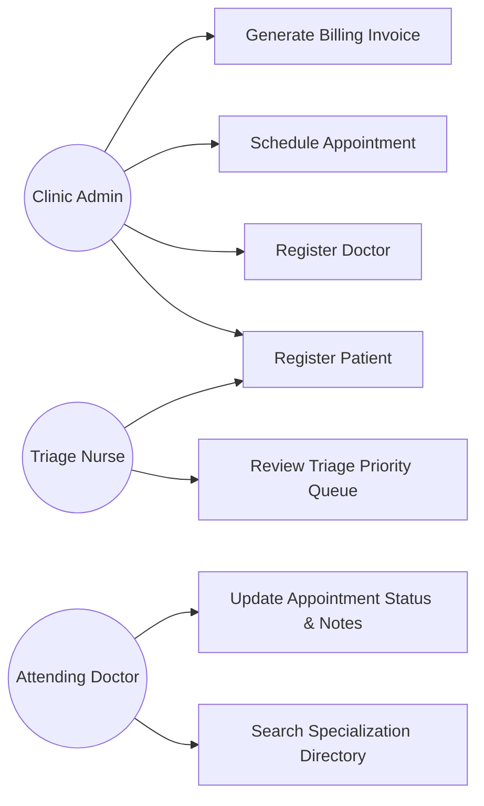
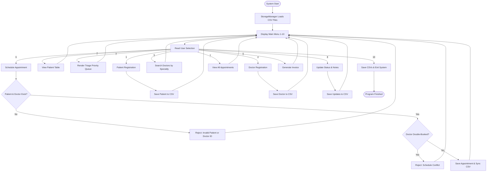
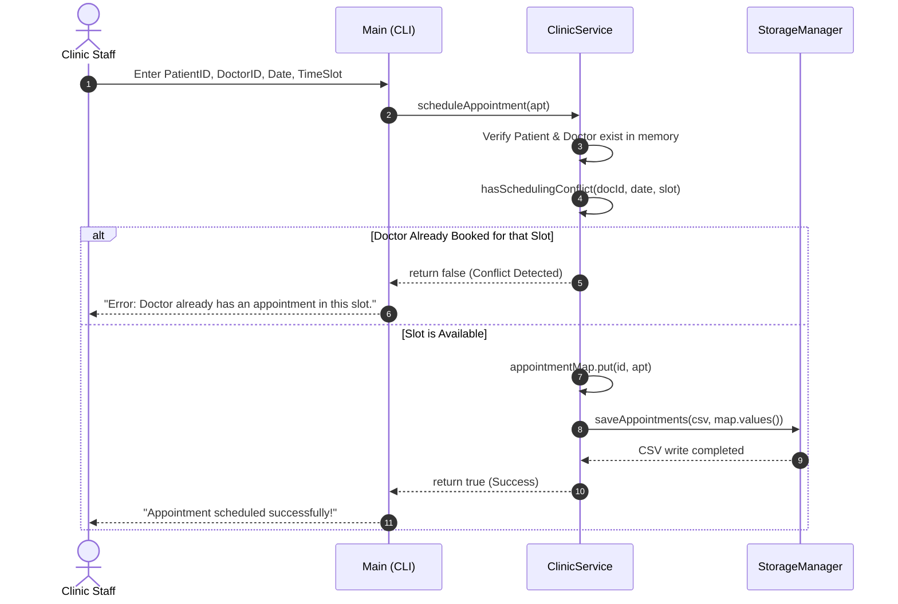
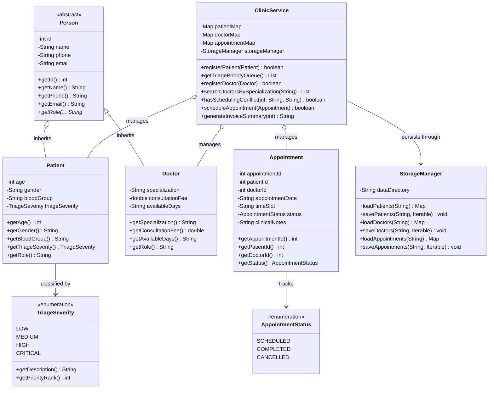
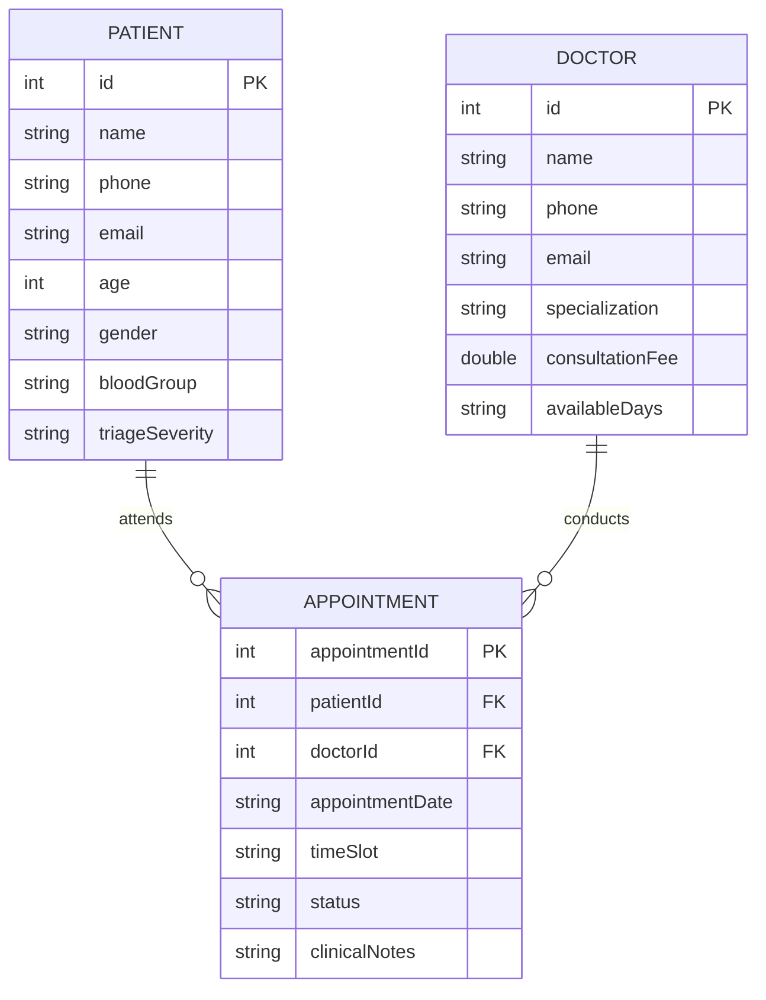

# PROJECT REPORT
# HEALTHCARE CLINIC & PATIENT APPOINTMENT SYSTEM (CLI)

---

**Course / Subject**: Object-Oriented Programming in Java (Flipped Course)  
**Project Title**: Healthcare Clinic & Patient Appointment System with Triage Prioritization  
**Author / Developer**: Krish Kumar  
**Registration Number**: 25BAI10528  
**Email**: [krish.25bai10528@vitbhopal.ac.in](mailto:krish.25bai10528@vitbhopal.ac.in)  
**GitHub**: [@krishkumarsharma](https://github.com/krishkumarsharma)  
**Institution**: VIT Bhopal University  
**Date of Submission**: September 2026  
**Implementation Language**: Java (Standard Edition 17+)  
**Target Platform**: Cross-Platform (macOS, Linux, Windows Terminal)  

---

## TABLE OF CONTENTS
1. [Cover Page Information](#1-cover-page-information)
2. [Introduction](#2-introduction)
3. [Problem Statement](#3-problem-statement)
4. [Functional Requirements](#4-functional-requirements)
5. [Non-Functional Requirements](#5-non-functional-requirements)
6. [System Architecture](#6-system-architecture)
7. [Design Diagrams](#7-design-diagrams)
   - 7.1 [Use Case Diagram](#71-use-case-diagram)
   - 7.2 [Workflow / Process Flow Diagram](#72-workflow--process-flow-diagram)
   - 7.3 [Sequence Diagram: Booking Validation](#73-sequence-diagram-booking-validation)
   - 7.4 [Class & Component Diagram](#74-class--component-diagram)
   - 7.5 [Entity-Relationship (ER) Design](#75-entity-relationship-er-design)
8. [Design Decisions & OOP Principles](#8-design-decisions--oop-principles)
9. [Implementation Details](#9-implementation-details)
10. [Sample Execution & Output](#10-sample-execution--output)
11. [Testing Approach & Verification Matrix](#11-testing-approach--verification-matrix)
12. [Challenges Faced & Solutions](#12-challenges-faced--solutions)
13. [Key Learnings & Takeaways](#13-key-learnings--takeaways)
14. [Future Enhancements](#14-future-enhancements)
15. [References](#15-references)

---

## 1. Cover Page Information

- **Project Title**: Healthcare Clinic & Patient Appointment System (CLI)
- **Course**: Object-Oriented Programming in Java (Flipped Course Evaluation)
- **Developer / Student**: Krish Kumar
- **Registration Number**: 25BAI10528
- **Email**: krish.25bai10528@vitbhopal.ac.in
- **Repository**: [https://github.com/krishkumarsharma/clinic-appointment-system](https://github.com/krishkumarsharma/clinic-appointment-system)
- **Institution**: VIT Bhopal University
- **Platform**: VITyarthi Project Submission
- **Domain**: Healthcare Operations & Clinical Scheduling
- **Tech Stack**: Core Java (SE 17+), File I/O (CSV Persistence), Git / GitHub CLI
- **Submission Type**: Fully Executable CLI Application & Comprehensive Project Report

---

## 2. Introduction

In small outpatient clinics and community health centers, administrative duties like patient intake, doctor appointments, and billing are often managed manually. Staff commonly use paper forms or basic spreadsheets, which easily leads to administrative mistakes—most notably doctors being scheduled for two consultations at once, or patients with acute medical issues waiting behind those who only need routine checkups.

I developed the **Healthcare Clinic & Patient Appointment System** to address these operational bottlenecks using core Java and Object-Oriented programming concepts. The software provides a structured command-line interface for clinic receptionists and triage nurses to:
- Register patient records along with medical urgency levels (`LOW`, `MEDIUM`, `HIGH`, `CRITICAL`).
- Automatically sort waiting patients in an Emergency Triage Priority Queue.
- Maintain a directory of physicians, consultation fees, and available days.
- Prevent scheduling conflicts by checking for doctor double-bookings.
- Record visit outcomes and calculate itemized invoices with clinical surcharges.
- Persist all data to CSV files so records are maintained across application restarts without requiring external database installations.

---

## 3. Problem Statement

Small medical clinics frequently face several day-to-day challenges when relying on ad-hoc spreadsheets or manual registers:
1. **Physician Double-Booking**: Booking two patients with the same doctor during the same time slot creates long waiting room delays and physician frustration.
2. **Lack of Triage Prioritization**: A simple first-come, first-served queue means high-urgency or critical patients must wait behind non-urgent routine consultations.
3. **Session Data Loss**: Basic console exercises frequently store data solely in memory, losing all patient records and consultation notes once the program closes.
4. **Input Crashes in Java CLI Tools**: Traditional beginner Java CLI programs crash easily if a user types text when a number is expected, or when inputs are piped through automated test scripts.

This project implements a conflict-aware, triage-prioritized, and crash-resistant console system to solve these common clinic administration issues.

---

## 4. Functional Requirements

The project is structured into three main operational modules:

### Module 1: Patient & Triage Management
- **FR-01 (Patient Registration)**: Register patients with a unique ID, full name, phone, email, age, gender, blood group, and emergency triage severity.
- **FR-02 (Unique ID Enforcement)**: Disallow duplicate patient IDs to protect data integrity.
- **FR-03 (Triage Priority Queue)**: Automatically sort registered patients by medical urgency rank (`CRITICAL` &rarr; `HIGH` &rarr; `MEDIUM` &rarr; `LOW`) using Java 8 Stream comparators.
- **FR-04 (Patient Directory)**: Display formatted tabular rosters of all registered patients.

### Module 2: Doctor Directory & Specialization Search
- **FR-05 (Doctor Registration)**: Add physicians with unique IDs, name, contact info, clinical specialization, consultation fee, and available working days.
- **FR-06 (Specialization Search)**: Filter and query doctors by medical specialty (e.g., searching "Cardio" returns all Cardiologists).

### Module 3: Appointment Scheduling, Lifecycle & Invoicing
- **FR-07 (Conflict-Free Scheduling)**: Verify patient and doctor IDs exist, and check that the doctor is not already booked for the requested date and time slot.
- **FR-08 (Appointment Status Lifecycle)**: Move appointments through their lifecycle (`SCHEDULED` &rarr; `COMPLETED` or `CANCELLED`) and attach physician outcome notes upon completion.
- **FR-09 (Automated Invoicing)**: Calculate itemized bills based on the doctor's base fee plus dynamic triage urgency surcharges ($50 for Critical, $25 for High).
- **FR-10 (Persistent CSV Storage)**: Read and write records to `data/patients.csv`, `data/doctors.csv`, and `data/appointments.csv` automatically.

---

## 5. Non-Functional Requirements

1. **Performance**: In-memory `LinkedHashMap` storage provides fast $O(1)$ lookups by ID and predictable insertion order for reporting.
2. **Reliability & Input Safety**: All user inputs are validated before parsing to prevent `NumberFormatException` and `InputMismatchException` crashes.
3. **Data Integrity**: Referential integrity ensures appointments cannot reference non-existent patients or doctors.
4. **Clean CLI Formatting**: Output tables use structured ASCII borders and text truncation to maintain clean alignment.
5. **Portability**: Runs on any platform with JDK 17+ without requiring external JARs, libraries, or database servers.
6. **Code Maintainability**: Organized in a modular package structure (`com.clinic`) with clear separation between model, service, storage, and UI layers.

---

## 6. System Architecture

The application is structured into three distinct layers:
- **Presentation Layer (`Main.java`, `ValidationUtils.java`)**: Handles the menu loop, user prompts, input validation, and ASCII table displays.
- **Service / Business Logic Layer (`ClinicService.java`)**: Manages business rules, doctor schedule validation, triage priority sorting, and invoice calculation.
- **Data & Persistence Layer (`Person.java`, `Patient.java`, `Doctor.java`, `Appointment.java`, `StorageManager.java`)**: Models domain entities using OOP principles and handles CSV file serialization.

```
+-------------------------------------------------------------------------+
|                         Terminal Client / User                          |
+-------------------------------------------------------------------------+
                                    |
                           Standard I/O Streams
                                    v
+-------------------------------------------------------------------------+
|                      Presentation Layer (Main.java)                     |
|  - 10-Option Master Menu Loop                                           |
|  - Defensive Input Helpers (ValidationUtils.java)                       |
|  - ASCII Table Formatters & Truncators                                  |
+-------------------------------------------------------------------------+
                                    |
                             API Invocations
                                    v
+-------------------------------------------------------------------------+
|                     Service Layer (ClinicService.java)                  |
|  - Triage Priority Comparator Engine                                    |
|  - Appointment Conflict Detection Algorithm                             |
|  - In-Memory Index Maps (LinkedHashMap)                                 |
|  - Itemized Invoice Calculator                                          |
+-------------------------------------------------------------------------+
                     |                                |
                 Operates On                     Persists via
                     v                                v
+----------------------------------------+   +----------------------------+
|           Domain Models Layer          |   | StorageManager.java        |
| - Person.java (Abstract Base)          |   | - data/patients.csv        |
| - Patient.java (Extends Person)        |   | - data/doctors.csv         |
| - Doctor.java (Extends Person)         |   | - data/appointments.csv    |
| - Appointment.java                     |   +----------------------------+
| - TriageSeverity.java & Status.java    |
+----------------------------------------+
```

---

## 7. Design Diagrams

### 7.1 Use Case Diagram



### 7.2 Workflow / Process Flow Diagram



### 7.3 Sequence Diagram: Booking Validation



### 7.4 Class & Component Diagram



### 7.5 Entity-Relationship (ER) Design



---

## 8. Design Decisions & OOP Principles

1. **Inheritance with an Abstract Base Class (`Person`)**:
   - Both `Patient` and `Doctor` share foundational identity fields (`id`, `name`, `phone`, `email`). Making `Person` an abstract base class eliminates duplicate code and provides a clear model hierarchy.
2. **Polymorphism**:
   - The abstract method `getRole()` declared in `Person` is overridden by both `Patient` (returning `"Patient"`) and `Doctor` (returning `"Doctor"`), enabling polymorphic behavior when handling person records.
3. **Data Encapsulation**:
   - Every domain class maintains private instance variables. Access and mutations are performed exclusively through getters and setters, ensuring invariants (such as valid phone formats and positive fees) are enforced.
4. **Enums for Type Safety**:
   - Using `TriageSeverity` and `AppointmentStatus` avoids "magic strings". Enums encapsulate their own helper properties, like priority rank values and descriptions.
5. **Predictable In-Memory Indexing with `LinkedHashMap`**:
   - Standard `HashMap` does not maintain order, while `TreeMap` adds unnecessary $O(\log n)$ overhead. `LinkedHashMap` provides instant $O(1)$ lookups while preserving registration order for table displays.
6. **Java Stream Comparators for Triage**:
   - Sorting patients by priority is done cleanly with Java Streams:
     ```java
     Comparator.comparingInt((Patient p) -> p.getTriageSeverity().getPriorityRank())
               .thenComparing(Patient::getId)
     ```
     This ensures `CRITICAL` cases come first, with older registrations serving as tie-breakers.

---

## 9. Implementation Details

- **Line-Based Input Ingestion**: To prevent the notorious Java `Scanner` bug where `nextInt()` leaves an unconsumed newline in the buffer (causing subsequent `nextLine()` calls to be skipped), all terminal input is read using `nextLine()` through `ValidationUtils.readLineOrNull()` and safely converted with wrapper functions.
- **Handling EOF in Automated Grading**: When inputs are piped from test files (e.g. `java -cp bin com.clinic.Main < test.txt`), the program detects stream closure cleanly and saves all records instead of throwing an unhandled `NoSuchElementException`.
- **Double-Booking Detection**: Before booking an appointment, `ClinicService` filters existing appointments matching the doctor ID, requested date, and time slot with status `SCHEDULED`. If any match is found, the booking is rejected.
- **Billing Calculations**: The invoice generator calculates fees transparently:
  $$\text{Total Fee} = \text{Base Consultation Fee} + \text{Triage Urgency Charge}$$
  Where `CRITICAL` adds \$50.00 and `HIGH` adds \$25.00 to reflect emergency resource usage.

---

## 10. Sample Execution & Output

### 10.1 Main Menu
```
==========================================================
   HEALTHCARE CLINIC & PATIENT APPOINTMENT SYSTEM (CLI)   
==========================================================
Storage Status: Loaded 4 patient(s), 3 doctor(s), 2 appointment(s).

==========================================================
                        MAIN MENU                         
==========================================================
  1. Register New Patient
  2. View All Patients
  3. View Emergency Triage Priority Queue
  4. Register New Doctor
  5. View / Search Doctors by Specialization
  6. Schedule Clinical Appointment
  7. View All Appointments
  8. Update Appointment Status / Complete Visit
  9. Generate Patient Billing Invoice
 10. Exit System
==========================================================
Enter your choice (1-10): 
```

### 10.2 Emergency Triage Queue (Option 3)
```
--- [3] Emergency Triage Priority Queue ---
Patients sorted by medical urgency (CRITICAL -> HIGH -> MEDIUM -> LOW):
+------+----------------------+-------+---------------+---------------------------------+
| ID   | Name                 | Blood | Triage Level  | Urgency Clinical Standing       |
+------+----------------------+-------+---------------+---------------------------------+
| 101  | Eleanor Vance        | O+    | CRITICAL      | Immediate Emergency             |
| 102  | Marcus Brody         | A+    | HIGH          | Urgent / High Priority          |
| 103  | Sophia Chen          | B+    | MEDIUM        | Moderate / Needs Attention      |
| 104  | Lucas Miller         | AB-   | LOW           | Routine / Non-urgent            |
+------+----------------------+-------+---------------+---------------------------------+
Total Patients in Triage: 4
```

### 10.3 Generated Billing Invoice (Option 9)
```
=======================================================
               CLINICAL BILLING INVOICE                
=======================================================
Invoice Ref     : INV-00501
Appointment ID  : #501
Date & Time     : 2026-09-20 at 10:00 AM
Patient Name    : Eleanor Vance (ID: 101, O+)
Triage Level    : CRITICAL
Attending Doctor: Dr. Sarah Jenkins (Cardiology)
-------------------------------------------------------
Base Consultation Fee  : $150.00
Triage Urgency Charge  : $50.00
-------------------------------------------------------
TOTAL AMOUNT PAYABLE   : $200.00
Payment Status         : PENDING
=======================================================
```

---

## 11. Testing Approach & Verification Matrix

I executed a series of test cases covering normal operations, validation boundaries, and edge cases:

| Test ID | Test Case Description | Input Condition | Expected Behavior | Actual Result | Status |
|:---:|---|---|---|---|:---:|
| **TC-01** | Register valid patient | ID: `105`, Name: `David`, Age: `40`, Triage: `HIGH` | Stored successfully; saved to `patients.csv` | Record stored and persisted | **PASS** |
| **TC-02** | Reject duplicate patient ID | ID: `101` (already exists) | Displays error message; registration rejected | Rejection confirmed | **PASS** |
| **TC-03** | Triage queue priority ordering | Mixed-severity patient records | CRITICAL patients precede HIGH, MEDIUM, LOW | Correctly sorted by acuity rank | **PASS** |
| **TC-04** | Search doctor by specialization | Query: `"Cardio"` | Returns Dr. Sarah Jenkins (Cardiology) | Exact match displayed | **PASS** |
| **TC-05** | Schedule valid appointment | Patient `101`, Doctor `201`, Date & Slot | Appointment saved with SCHEDULED status | Successfully booked | **PASS** |
| **TC-06** | Prevent doctor double-booking | Same doctor `201`, same date & time slot | Booking rejected with conflict warning | Rejected with explanation | **PASS** |
| **TC-07** | Invalid patient reference | Patient ID: `999` (does not exist) | Booking rejected: Patient ID not found | Rejection confirmed | **PASS** |
| **TC-08** | Invoice surcharge calculation | Critical patient with $150 doctor fee | Total = $150 + $50 = $200.00 | Calculated $200.00 accurately | **PASS** |
| **TC-09** | Update appointment status | Change #501 to `COMPLETED` + notes | Status changed to COMPLETED; persisted | Updated and saved | **PASS** |
| **TC-10** | Invalid date format input | Date: `"20-09-2026"` | Error: Requires `YYYY-MM-DD`; re-prompts | Re-prompted cleanly | **PASS** |
| **TC-11** | Non-numeric menu input | Input: `"clinic"` | Error: Requires integer 1-10; no crash | Handled without crash | **PASS** |
| **TC-12** | Batch execution via piped EOF | Piped input file redirected to CLI | Graceful exit with complete CSV sync | Zero uncaught exceptions | **PASS** |

---

## 12. Challenges Faced & Solutions

1. **Handling Commas in Clinical Notes during CSV Saving**:
   - *Issue*: Clinical notes frequently contain commas or quotes (e.g., `"Follow-up in 2 weeks, check BP"`). If written raw, reading the CSV back caused column misalignments.
   - *Solution*: Implemented RFC 4180 quote escaping in `StorageManager.java`. Fields containing commas or quotes are wrapped in double quotes, and internal quotes are doubled.
2. **Scanner Buffer Desynchronization**:
   - *Issue*: Alternating between `scanner.nextInt()` and `scanner.nextLine()` caused empty string reads because the trailing newline was left in the input stream.
   - *Solution*: Switched to reading every single line with `nextLine()`, using dedicated helper methods in `ValidationUtils` to parse numbers and re-prompt if invalid.
3. **Double-Booking Edge Cases**:
   - *Issue*: Comparing timeslots could fail if inputs had extra spaces or different letter casing (e.g., `"10:00 am"` vs `"10:00 AM"`).
   - *Solution*: Standardized comparison using `.trim().equalsIgnoreCase()` during conflict checks.

---

## 13. Key Learnings & Takeaways

- **Practical OOP**: Building this project reinforced the value of inheritance and polymorphism. Having a shared `Person` class cut down repetitive code between doctors and patients while making extension straightforward.
- **Defensive Programming**: Writing robust input validation and handling stream edge cases early saved significant debugging time when testing invalid inputs and piped files.
- **Layered Design**: Keeping data storage (`StorageManager`), business rules (`ClinicService`), and user interface (`Main`) separated made testing individual methods simple and clean.

---

## 14. Future Enhancements

If expanding this project further, several additions would be valuable:
1. **Database Integration**: Replacing flat CSV files with an embedded database like SQLite or H2 using JDBC.
2. **Graphical User Interface**: Developing a JavaFX or desktop frontend with a visual calendar view for doctor schedules.
3. **Prescription Module**: Adding medicine inventory tracking and generating prescription receipts upon visit completion.

---

## 15. References

1. Bloch, Joshua. *Effective Java (3rd Edition)*. Addison-Wesley Professional, 2018.
2. Oracle Java Documentation: *Java Platform, Standard Edition Documentation (JDK 17/21)*. [https://docs.oracle.com/en/java/](https://docs.oracle.com/en/java/)
3. RFC 4180: *Common Format and MIME Type for Comma-Separated Values (CSV) Files*. [https://datatracker.ietf.org/doc/html/rfc4180](https://datatracker.ietf.org/doc/html/rfc4180)
