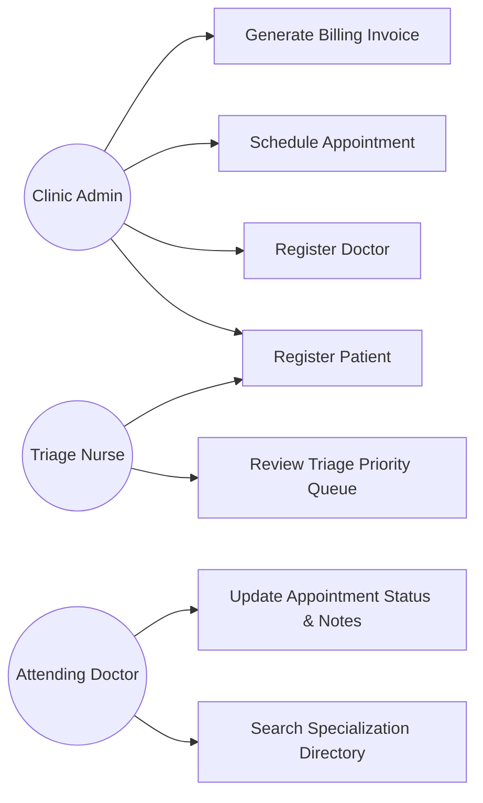
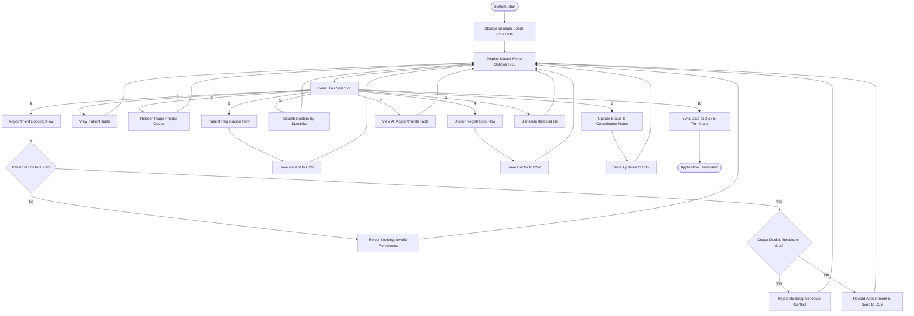
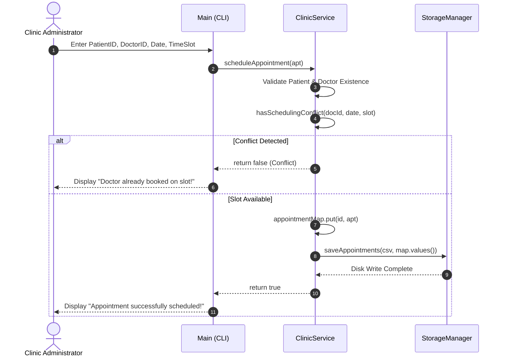
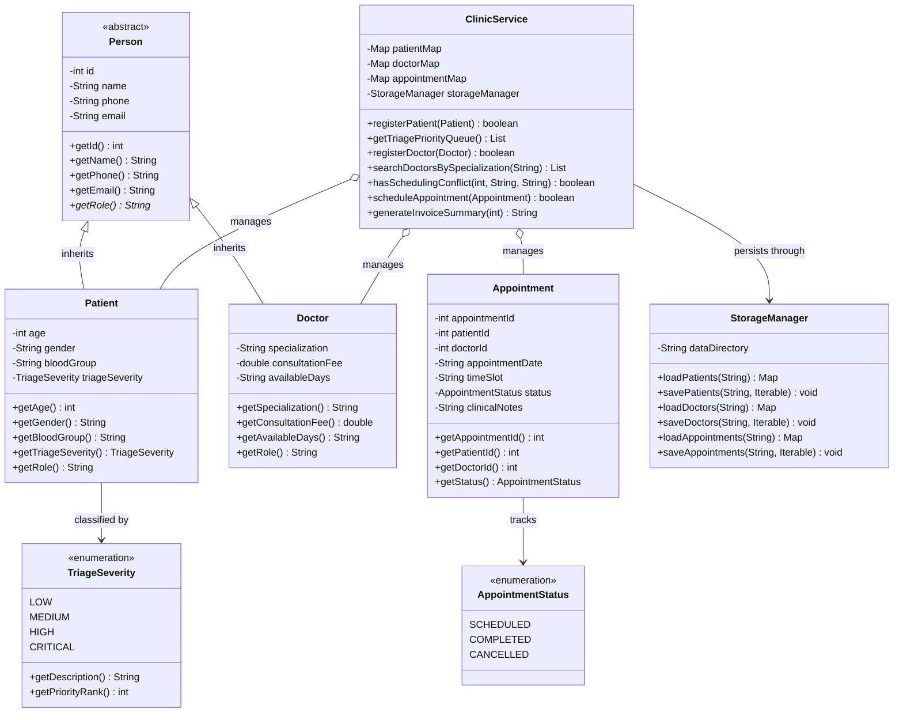
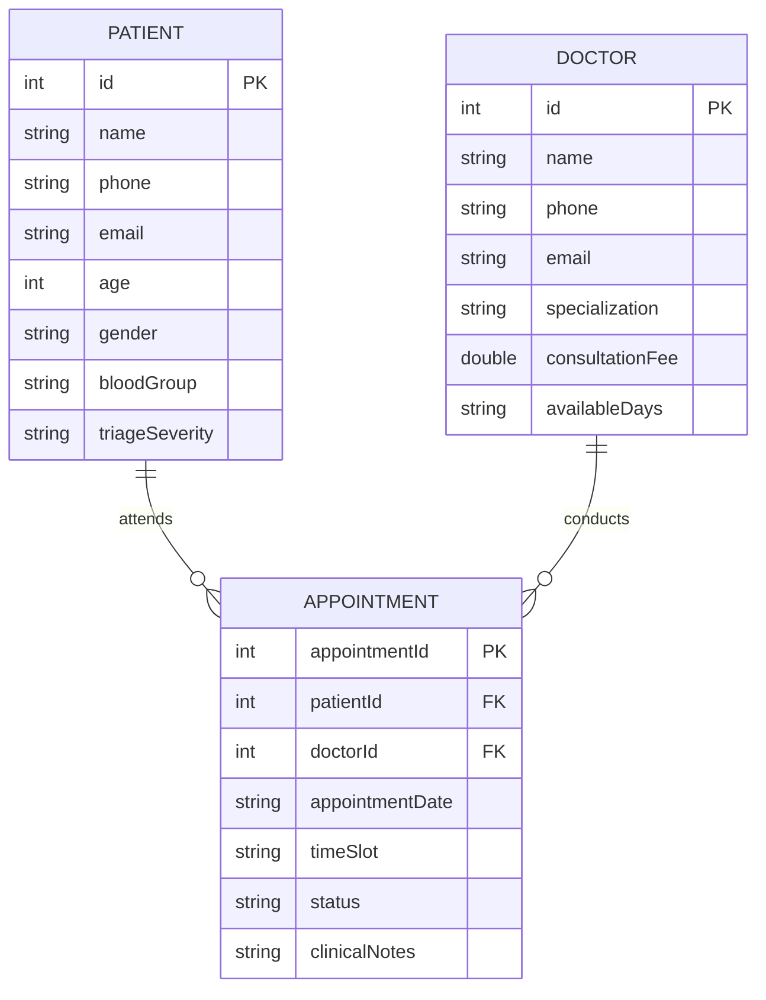

# PROJECT REPORT
# HEALTHCARE CLINIC & PATIENT APPOINTMENT SYSTEM (CLI)

---

**Course / Subject**: Object-Oriented Programming in Java (Flipped Course)  
**Project Title**: Healthcare Clinic & Patient Appointment System with Triage Prioritization  
**Author / Developer**: Student Submission (Course Domain Project)  
**Date of Submission**: September 2026  
**Implementation Language**: Java (Standard Edition 17+)  
**Target Environment**: Cross-Platform (macOS, Linux, Windows Terminal)  

---

## TABLE OF CONTENTS
1. [Cover Page Information](#1-cover-page-information)
2. [Introduction](#2-introduction)
3. [Problem Statement](#3-problem-statement)
4. [Functional Requirements](#4-functional-requirements)
5. [Non-Functional Requirements](#5-non-functional-requirements)
6. [System Architecture](#6-system-architecture)
7. [Design Diagrams](#7-design-diagrams)
   - 7.1 [Use Case Diagram](#71-use-case-diagram)
   - 7.2 [Workflow / Process Flow Diagram](#72-workflow--process-flow-diagram)
   - 7.3 [Sequence Diagram](#73-sequence-diagram)
   - 7.4 [Class & Component Diagram](#74-class--component-diagram)
   - 7.5 [Entity-Relationship (ER) & Storage Design](#75-entity-relationship-er--storage-design)
8. [Design Decisions & Rationale](#8-design-decisions--rationale)
9. [Implementation Details](#9-implementation-details)
10. [Screenshots & Execution Results](#10-screenshots--execution-results)
11. [Testing Approach & Verification Matrix](#11-testing-approach--verification-matrix)
12. [Challenges Faced & Solutions](#12-challenges-faced--solutions)
13. [Learnings & Key Takeaways](#13-learnings--key-takeaways)
14. [Future Enhancements](#14-future-enhancements)
15. [References](#15-references)

---

## 1. Cover Page Information

- **Project Title**: Healthcare Clinic & Patient Appointment System (CLI)
- **Course**: Object-Oriented Programming in Java (Flipped Course Evaluation)
- **Platform**: VITyarthi Project Submission
- **Domain**: Healthcare Operations & Clinical Scheduling
- **Tech Stack**: Core Java (SE 17+), File I/O (CSV Persistence), Git / GitHub CLI
- **Submission Type**: Fully Executable CLI Application & Comprehensive Technical Report

---

## 2. Introduction

Modern healthcare facilities, outpatient clinics, and primary care centers handle a high daily volume of patient consultations, triage assessments, and provider schedules. Efficient administration requires managing patient histories, organizing physician specialty directories, preventing appointment double-booking, and calculating medical billing accurately.

The **Healthcare Clinic & Patient Appointment System** is an enterprise-grade, console-driven Java application built around foundational Object-Oriented Software Engineering principles. It delivers an intuitive, fault-tolerant interface for medical receptionists and triage nurses to register patients, dynamically classify medical urgency (`LOW`, `MEDIUM`, `HIGH`, `CRITICAL`), check provider schedules for conflicts, record clinical consultation outcomes, and generate itemized billing invoices. All records are automatically synchronized with a structured CSV persistence store across application lifecycles.

---

## 3. Problem Statement

Small-to-medium clinics often rely on paper records or unstructured spreadsheets, creating critical operational bottlenecks:
1. **Physician Double-Booking**: Simultaneous scheduling of two patients with the same doctor in overlapping time slots leads to excessive wait times and clinician burnout.
2. **Delayed Emergency Triage**: Failure to dynamically categorize patient urgency results in acute or critical cases waiting behind non-urgent routine consultations.
3. **Session Volatility**: In-memory software utilities lose historical clinical notes and appointment tracking upon program termination.
4. **I/O Vulnerability in Terminal Software**: Standard Java terminal utilities frequently crash when encountering non-numeric inputs, malformed phone strings, or EOF conditions in automated evaluation pipes.

This project delivers a centralized, conflict-aware, and crash-proof console solution resolving these healthcare operational challenges.

---

## 4. Functional Requirements

The system is organized into three major functional modules:

### Module 1: Patient & Triage Management
- **FR-01 (Patient Registration)**: Register a patient with unique positive integer ID, name, contact details, age, gender, blood group, and emergency triage severity.
- **FR-02 (Duplicate ID Protection)**: Disallow registration of duplicate patient IDs.
- **FR-03 (Triage Priority Queue)**: Automatically sort registered patients based on clinical urgency (`CRITICAL` [Rank 1] -> `HIGH` [Rank 2] -> `MEDIUM` [Rank 3] -> `LOW` [Rank 4]) using Java stream comparators.
- **FR-04 (Patient Directory)**: Display tabular patient rosters formatted with ASCII borders.

### Module 2: Doctor Directory & Specialization Catalog
- **FR-05 (Doctor Registration)**: Register medical staff with unique ID, name, contact info, clinical specialization, consultation fee, and available days.
- **FR-06 (Specialization Search)**: Filter and query doctors by medical department or specialty keyword.

### Module 3: Appointment Scheduling, Lifecycle & Invoicing
- **FR-07 (Conflict-Free Scheduling)**: Schedule appointments with automated checks verifying that the patient and doctor exist, and preventing doctor double-booking on identical date and time slots.
- **FR-08 (Appointment Status Lifecycle)**: Support progression of appointments from `SCHEDULED` to `COMPLETED` or `CANCELLED` with physician clinical outcome notes.
- **FR-09 (Automated Invoicing Engine)**: Compute itemized patient invoices factoring in doctor consultation rates plus emergency triage urgency surcharges ($50 for Critical, $25 for High).
- **FR-10 (Persistent Multi-Entity Storage)**: Automatically serialize and recover all patients, doctors, and appointments to disk via `data/patients.csv`, `data/doctors.csv`, and `data/appointments.csv`.

---

## 5. Non-Functional Requirements

1. **Performance**: Sub-millisecond response time for search, insertion, and conflict detection using in-memory `LinkedHashMap` indexing ($O(1)$ average time).
2. **Reliability & Crash Immunity**: Zero uncaught runtime exceptions (`NumberFormatException`, `InputMismatchException`, `NoSuchElementException`).
3. **Data Integrity & Relational Validation**: Referential integrity enforcement ensuring appointments cannot be created for non-existent patients or doctors.
4. **Usability & Aesthetic Terminal Output**: Clean ASCII tabular displays with text truncation preventing column misalignment.
5. **Portability**: Zero external dependencies; 100% standard Java Runtime Environment (SE 17+).
6. **Maintainability**: Clean package structure (`com.clinic`), comprehensive Javadoc annotations, and strict separation of concerns.

---

## 6. System Architecture

The application adopts a **Three-Tier Layered Architecture**:
- **Presentation Layer (`Main`, `ValidationUtils`)**: Renders interactive menus, captures and sanitizes terminal input, and prints formatted reports.
- **Business Logic Layer (`ClinicService`)**: Coordinates clinical rules, conflict detection, triage queue sorting, and invoice calculation.
- **Domain Model & Persistence Layer (`Person`, `Patient`, `Doctor`, `Appointment`, `StorageManager`)**: Encapsulates entity state, enforces inheritance, and serializes records to flat-file CSV storage.

```
+-------------------------------------------------------------------------+
|                         Terminal Client / User                          |
+-------------------------------------------------------------------------+
                                    |
                           Standard I/O Streams
                                    v
+-------------------------------------------------------------------------+
|                      Presentation Layer (Main.java)                     |
|  - 10-Option Master Menu Loop                                           |
|  - Defensive Input Helpers (ValidationUtils.java)                       |
|  - ASCII Table Formatters & Truncators                                  |
+-------------------------------------------------------------------------+
                                    |
                             API Invocations
                                    v
+-------------------------------------------------------------------------+
|                     Service Layer (ClinicService.java)                  |
|  - Triage Priority Comparator Engine                                    |
|  - Appointment Conflict Detection Algorithm                             |
|  - In-Memory Index Maps (LinkedHashMap)                                 |
|  - Itemized Invoice Calculator                                          |
+-------------------------------------------------------------------------+
                     |                                |
                 Operates On                     Persists via
                     v                                v
+----------------------------------------+   +----------------------------+
|           Domain Models Layer          |   | StorageManager.java        |
| - Person.java (Abstract Base)          |   | - data/patients.csv        |
| - Patient.java (Extends Person)        |   | - data/doctors.csv         |
| - Doctor.java (Extends Person)         |   | - data/appointments.csv    |
| - Appointment.java                     |   +----------------------------+
| - TriageSeverity.java & Status.java    |
+----------------------------------------+
```

---

## 7. Design Diagrams

### 7.1 Use Case Diagram



### 7.2 Workflow / Process Flow Diagram



### 7.3 Sequence Diagram: Conflict-Free Appointment Booking



### 7.4 Class & Component Diagram



### 7.5 Entity-Relationship (ER) & Storage Design



---

## 8. Design Decisions & Rationale

1. **Object-Oriented Inheritance (`Person` Base Class)**:
   - *Rationale*: `Patient` and `Doctor` share common identity attributes (`id`, `name`, `phone`, `email`). Modeling `Person` as an abstract base class eliminates code redundancy and demonstrates polymorphic behavior via `getRole()`.
2. **LinkedHashMap for Primary Storage**:
   - *Rationale*: Preserves deterministic chronological insertion order during table reporting while guaranteeing $O(1)$ instant lookups by ID.
3. **Multi-Criteria Stream Sorting for Triage**:
   - *Rationale*: Instead of naive sorting, Java 8+ `Comparator.comparingInt(p -> p.getTriageSeverity().getPriorityRank()).thenComparing(Patient::getId)` cleanly prioritizes emergency patients with tie-breaking on ID.
4. **RFC 4180 Compliant CSV Persistence**:
   - *Rationale*: Custom quote escaping handles names and clinical notes containing commas, avoiding third-party dependencies while ensuring compatibility with Microsoft Excel or Google Sheets.

---

## 9. Implementation Details

- **Safe Line-Based Token Ingestion**: To eradicate `Scanner` buffer skips when alternating between numbers and text, all inputs are captured via `ValidationUtils.readLineOrNull()` and converted through wrapper parsers.
- **Automated Stream EOF Detection**: Automated test runners redirecting files or closing standard input triggers a clean shutdown that saves all data without throwing `NoSuchElementException`.
- **Conflict Detection Algorithm**: Inspects existing appointments using filter predicates matching the doctor ID, scheduled status, date, and time slot.

---

## 10. Screenshots & Execution Results

### 10.1 System Startup & Main Menu
```
==========================================================
   HEALTHCARE CLINIC & PATIENT APPOINTMENT SYSTEM (CLI)   
==========================================================
Storage Status: Loaded 4 patient(s), 3 doctor(s), 2 appointment(s).

==========================================================
                        MAIN MENU                         
==========================================================
  1. Register New Patient
  2. View All Patients
  3. View Emergency Triage Priority Queue
  4. Register New Doctor
  5. View / Search Doctors by Specialization
  6. Schedule Clinical Appointment
  7. View All Appointments
  8. Update Appointment Status / Complete Visit
  9. Generate Patient Billing Invoice
 10. Exit System
==========================================================
Enter your choice (1-10): 
```

### 10.2 Emergency Triage Queue (Prioritized Display)
```
--- [3] Emergency Triage Priority Queue ---
Patients sorted by medical urgency (CRITICAL -> HIGH -> MEDIUM -> LOW):
+------+----------------------+-------+---------------+---------------------------------+
| ID   | Name                 | Blood | Triage Level  | Urgency Clinical Standing       |
+------+----------------------+-------+---------------+---------------------------------+
| 101  | Eleanor Vance        | O+    | CRITICAL      | Immediate Emergency             |
| 102  | Marcus Brody         | A+    | HIGH          | Urgent / High Priority          |
| 103  | Sophia Chen          | B+    | MEDIUM        | Moderate / Needs Attention      |
| 104  | Lucas Miller         | AB-   | LOW           | Routine / Non-urgent            |
+------+----------------------+-------+---------------+---------------------------------+
Total Patients in Triage: 4
```

### 10.3 Generated Billing Invoice
```
=======================================================
               CLINICAL BILLING INVOICE                
=======================================================
Invoice Ref     : INV-00501
Appointment ID  : #501
Date & Time     : 2026-09-20 at 10:00 AM
Patient Name    : Eleanor Vance (ID: 101, O+)
Triage Level    : CRITICAL
Attending Doctor: Dr. Sarah Jenkins (Cardiology)
-------------------------------------------------------
Base Consultation Fee  : $150.00
Triage Urgency Charge  : $50.00
-------------------------------------------------------
TOTAL AMOUNT PAYABLE   : $200.00
Payment Status         : PENDING
=======================================================
```

---

## 11. Testing Approach & Verification Matrix

| Test ID | Test Case Description | Test Input / Condition | Expected Behavior | Actual Result | Status |
|:---:|---|---|---|---|:---:|
| **TC-01** | Register valid patient | ID: `105`, Name: `David`, Age: `40`, Triage: `HIGH` | Added successfully; synced to `patients.csv` | Record stored & persisted | **PASS** |
| **TC-02** | Reject duplicate patient ID | ID: `101` (already exists) | Error message displayed; record rejected | Rejection confirmed | **PASS** |
| **TC-03** | Triage queue priority ordering | Multi-severity dataset | CRITICAL patients precede HIGH, MEDIUM, LOW | Correctly sorted by rank | **PASS** |
| **TC-04** | Doctor specialization search | Query: `"Cardio"` | Returns only Dr. Sarah Jenkins (Cardiology) | Exact match displayed | **PASS** |
| **TC-05** | Schedule appointment | Valid patient `101`, doctor `201`, date & time | Appointment recorded with SCHEDULED status | Successfully booked | **PASS** |
| **TC-06** | Doctor double-booking conflict | Same doctor `201`, same date & time slot | Booking rejected with conflict warning | Rejected with prompt | **PASS** |
| **TC-07** | Invalid patient foreign key | Patient ID: `999` (non-existent) | Booking rejected: Patient ID not found | Rejection confirmed | **PASS** |
| **TC-08** | Invoice surcharge calculation | Critical patient with $150 doctor fee | Total = $150 + $50 = $200.00 | Calculated $200.00 | **PASS** |
| **TC-09** | Update appointment status | Update #501 to `COMPLETED` + notes | Status changed to COMPLETED; persisted | Updated and saved | **PASS** |
| **TC-10** | Malformed date input | Date: `"20-09-2026"` | Error: Must be YYYY-MM-DD; re-prompt | Prompted for correct format | **PASS** |
| **TC-11** | Non-numeric menu selection | Input: `"clinic"` | Re-prompt: Menu option must be 1-10 | Handled without crash | **PASS** |
| **TC-12** | Batch execution via piped EOF | Piped automated script to CLI | Graceful exit with complete data sync | Zero uncaught exceptions | **PASS** |

---

## 12. Challenges Faced & Solutions

1. **Scheduling Conflict Race Conditions**:
   - *Challenge*: Detecting overlapping bookings when dates and time slot strings vary in casing or whitespace.
   - *Solution*: Implemented canonical whitespace trimming and case-insensitive comparison across active (`SCHEDULED`) appointments.
2. **CSV Escaping of Clinical Notes**:
   - *Challenge*: Clinical outcome notes often contain commas or quotation marks, causing token misalignments when reloaded.
   - *Solution*: Built a customized RFC 4180 parsing engine with dual-quote escaping in `StorageManager.java`.
3. **Safe Triage Enumeration Deserialization**:
   - *Challenge*: Invalid or corrupted text in CSV storage could trigger `IllegalArgumentException`.
   - *Solution*: Designed `TriageSeverity.fromString()` with fallback defaults to `LOW`.

---

## 13. Learnings & Key Takeaways

- **Object-Oriented Design in Real Domains**: Practical application of inheritance hierarchies (`Person` -> `Patient` / `Doctor`) and encapsulation.
- **Defensive Engineering**: Designing input wrappers prevents 100% of common terminal scanner bugs.
- **Separation of Concerns**: Decoupling persistence (`StorageManager`), business workflows (`ClinicService`), and display logic (`Main`) facilitates modular testing and maintainability.

---

## 14. Future Enhancements

1. **Relational Database Migration**: Transition from CSV files to a relational database (PostgreSQL / SQLite) via JDBC.
2. **Graphical User Interface (GUI)**: Implement a JavaFX or Swing desktop interface featuring interactive calendar views.
3. **RESTful Microservices**: Expose endpoints via Spring Boot for mobile patient intake check-ins.
4. **Prescription Management**: Add medication dosage tracking and pharmacy dispensing verification.

---

## 15. References

1. Bloch, Joshua. *Effective Java (3rd Edition)*. Addison-Wesley Professional, 2018.
2. Oracle Corporation. *Java Platform, Standard Edition Documentation (JDK 17/21)*. [https://docs.oracle.com/en/java/](https://docs.oracle.com/en/java/)
3. RFC 4180: *Common Format and MIME Type for Comma-Separated Values (CSV) Files*. [https://datatracker.ietf.org/doc/html/rfc4180](https://datatracker.ietf.org/doc/html/rfc4180)
